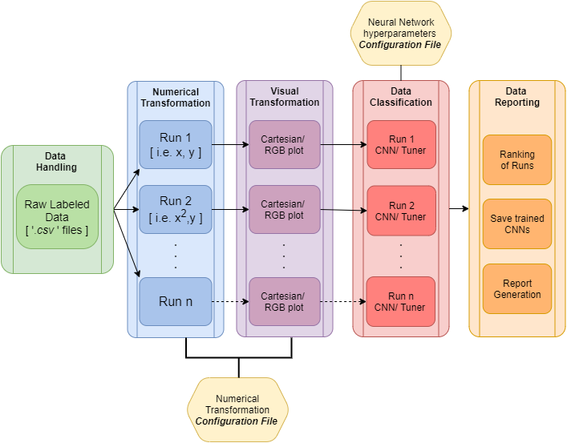

Advanced Functionalities
========================
The guide provided on `Getting Started` page uses the wrapper
function :code:`hardy_main` which sequentially executes
:code:`data_wrapper`, :code:`classifier_wrapper` and report generation.
The structure of :code:`HARDy` package is shown in the image below:

:code:`data_wrapper` parses through the transformation configuration
file and loads it into the environment. The :code:`data wrapper` also 
loads the :code:`.csv` files into the environment. The data wrapper
then applies the transformations, outlined in the configuration file,
to the data files. The :code:`data_wrapper` stores the tranformed
information into the :code:`.pkl` file or into :code:`.png` files
depending on the user defined arguments.

To save time :code:`data_wrapper` is capable of parallelizing the 
transformations process. The parallelization is controlled through the 
:code:`n_threads` parameter. By default, :code:`n_threads` is set a 1.

:code:`classifier_wrapper` loads the data generated by :code:`data_wrapper`. 
By default, :code:`classifier_wrapper` deletes the :code:`.pkl` generated
by the :code:`data_wrapper`. The loaded data is then ran through the 
convolutional neural network (CNN) or hyperparameter tuning sessions
depending upon the specified inputs from the user.

Each tuning session is then reported into :code:`data_reporting` module.
The tuned/trained model is then validated againt :code:`num_test_files_class`.
Then the report folder having :code:`project_name` in :code:`data_path`
is created. The report folder contains folders for each transformation run.
These transformation folders contains model validation results, best tuned model
for a particular transformation and model hyperparameter details.

Using Advanced Tools & Customization
------------------------------------

.. toctree::
    :maxdepth: 1
    :glob:

    transformations
    examples/rgb_cart.ipynb
    examples/using_data_reporting.ipynb