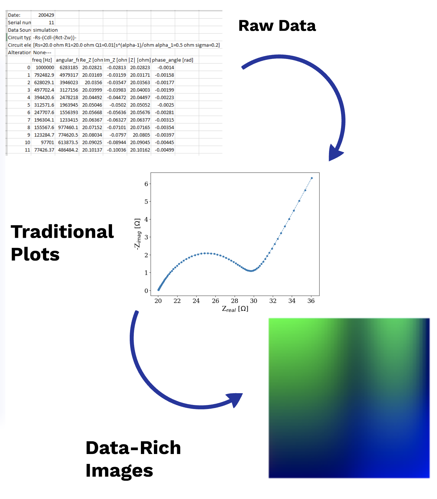

Getting Started
===============
:code:`HARDy` works by leveraging the information density in data
representation which makes it easier for machine to make inference
as compared to the human readable representation. This is achieved
through numerical and visual transformation. :code:`HARDy` in the
first stage achieves numerical transformation and then it transforms
it into RGB representation as shown in the image below:

:code:`Hardy`, by default, is configured to take minimal inputs
from the user and perform numerical and visual transformations 
on its own. The numerical transformations follow rules defined
by the user in a :code:`.yaml` configuration files. The user can
perform either hyperparamter search to evaluate best hyperparameters
or run a simple convolutional neural network (CNN).
The hyperparameter space for both tuning session
or :code:`CNN` can be defined in a :code:`.yaml` configuration
file. The guide to write configuration files is available at
`Guide to write configuration files 
<https://hardy.readthedocs.io/en/latest/examples/How_to_write_Configuration_files.html>`_

Data Preparation
----------------
:code:`HARDy` is configured to input :code:`.csv` files only. Before
starting your :code:`HARDy` run, make sure the data files are only in
:code:`.csv` format. Moreover, the :code:`.csv` files must have a header
of same length. Another parameter to keep in consideration is that all the
data files must have same number of data rows.

The wrapper function, :code:`run_hardy`, takes care of all the numerical
and visual transformations along with hyperparameter tuning and CNN runs.
The example script to run HARDy is as follows:

Importing HARDy library
-----------------------

The following code snippet imports :code:`hardy` into your respective environment::

    import hardy.run_hardy as run

Defining path variables
-----------------------
Defining the path to :code:`.csv` files::

    raw_data_path = 'path/to/raw/data/'

Defining the path to numerical configuration file::

    tform_config_path = './hardy/arbitrage/tform_config.yaml'

Defining the path to tuner or CNN configuration::

    classifier_config_path = './hardy/recognition/'

Setting up parameters
---------------------
The wrapper function of :code:`HARDy (hardy-main)` is capable to intake a large number
of user defined inputs. However, some important parameters that should be defined before
the runs are described here:

    * :code:`scale`: The RGB images generated by :code:`HARDy` are NxN dimensions, where N
      is the length of data rows in the csv files. It was observed that if the data
      has 500 rows, the RGB image would have 500x500 dimension. This exponentially
      increases the demand for RAM. To overcome this issue, :code:`scale` argument
      has been introduced to scale down the images. It uses :code:`scipy.misc.imresize`
      to scale down the image. :code:`scale` represents a fractional value for example
      0.1, 0.2.. 1.0
    * :code:`target_size`: target size is the product of :code:`scale` and :code:`N`.
      It is tuple of shape 1x2. For example, (100, 100)
    * :code:`num_test_files_class`: this is an integer value representing the number
      of files per category/class. This number of test of files will be seperated out
      from the training and only be utilized during final validation of model. The files
      are randomly selected. To control which data files are used, main function is capable
      of taking :code:`seed` as the input.
    * :code:`classes`: list of classes/categories in which data is categorized. Remembering
      the order of classes is important since this order is utilized for classfiying the
      new data inputs for a trained.
    * :code:`iterator_mode`: Since :code:`Keras` is capable of using either numpy array
      representation of data as well as image data, this string value controls which
      iterator to be used. If the value is :code:`arrays`, the RGB data representation
      will be in numpy array format and :code:`Keras` will use numpy iterator. If value
      other than the :code:`arrays`, PNG images will be generated, saved on disk and will
      be fed into the :code:`Keras` using a directory iterator.
    * :code:`n_threads`: This parameter controls the parallel processing of transformations.
      Since transformation configuration file may include saveral transformations, this parameter
      can assign each transformation to each n_thread available. A value of 6 would means
      each of the 6 threads will be utilized to run 6 transformations in parallel. The
      :code:`n_thread` parameter doesn't control the threads used for traning and tuning of
      neural networks. The neural network multiprocessing is either controlled through CUDA
      or default tensforflow operations.

Other arguments that can be given as input of :code:`hardy_main` function are described below

Executing hardy run
-------------------
The following code starts the numerical and visual transformations along with the
hyperparameter tuning session::

    run.hardy_main(raw_data_path, tform_config_path, classifier_config_path, batch_size=64,
    scale=0.2, num_test_files_class=750, target_size=(100, 100), iterator_mode='arrays',
    classifier='tuner', n_threads=1, classes=['class_1', 'class_2', 'class_3'],
    project_name='my_project_name')

The following arguments are acceptable in the :code:`hardy_main()` function:

    * ``raw_data_path``: data_path for the .csv files or images
    * ``tform_config_path``: path for transformation configuration files (.yaml)
    * ``classifier_config_path``: path for hyperparameter search (.yaml)
    * ``batch_size``: batch size for splitting of training and testing of data in machine learning model
    * ``scale``: the scale to which plots are reduce
    * ``num_test_files_class``: The number of test files per class. These files would be reserved for final testing of machine learning model
    * ``target_size``: number of data points in the csv files or dimension of images
    * ``iterator_mode``: if "arrays", the data is fed into machine learning model in array structure. For other values, images files are saved first in .png format and then fed into machine learning model through directory iterators.
    * ``classifier``: tuner or cnn model. Tuner means hyperparameter search while other options execute pre-defined convolutional neural network.
    * ``n_thread``: number of threads used for parallel transformation of data
    * ``classes``: labels or categories in data. If .csv files are used, the label must be present in the filename. If images are used, the images must be contained in respective folders
    * ``project_name``: name for the project. Folder with same name will be created in the raw_data_path containing all the results for the run
    * ``plot_format``: format of the plot to be used for training and testing of data. RGBrgb corresponds to usage of RGB images while any other argument will use cartesian coordinate system.
    * ``skiprows``: Used to skip the metadata contained in the csv files. It must be of same length for all classes.
    * ``split``: The fraction of data used for training and testing of machine learning model. This is different from num_test_files_class since the later one is never fed into machine learning model until the best hyperparameter search is done.
    * ``seed``: the seed used for random-selection of num_test_files_class
    * ``k_fold``: Boolean value indicating whether k-fold validation need to be performed or not
    * ``k``: value indicating how many k-folds need to be performed

