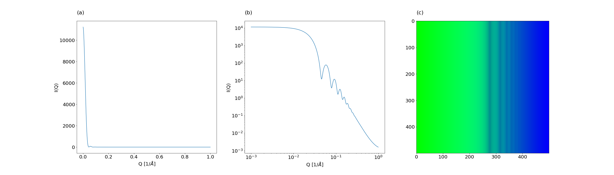
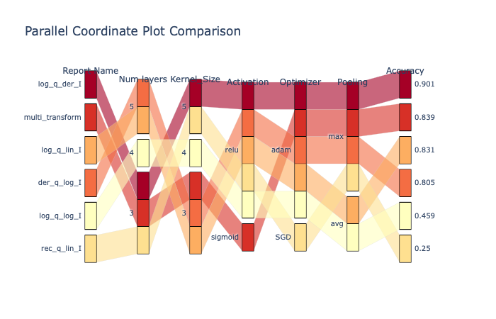
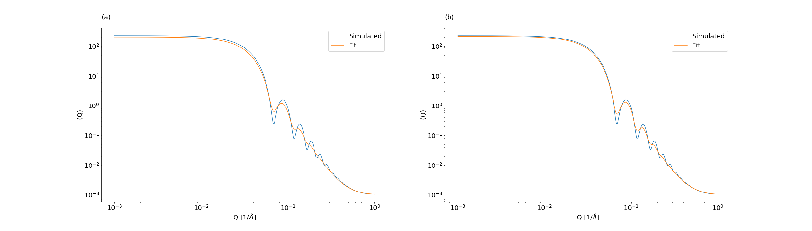

`HARDy` is a python package that helps evaluate differences in data through feature engineering coupled with kernel methods. The package provides an extension to machine learning by adding layers of feature transformation and representation. The workflow of the package is as follows:

- _Configuration_: Setting attributes for user-defined transformations, machine learning hyperparameters or hyperparameter space
- _Handling_: Import data from `.csv` files and loads into the catalogue
- _Arbitrage_: Applies user defined numerical and visual transformations to the data
- _Recognition_: Machine Learning module that applies user defined hyper-parameter search space for training and evaluation of model
- _Data-Reporting_: Import results of machine learning models and reports it into dataframes and plots

# Background

The increase in need of sustainable solutions to reduce carbon footprint has made High Throughput Experimentation (HTE) and High Throughput Testing (HTT) inevitable in scientific setups. One of the major bottlenecks in implementation of HTE and HTT is the data analysis. Many researchers have employed machine learning approaches to analyze data to facilitate discovery of catalysts, process parameters, and classification of experimental data [@williams2019enabling; @becker2019low]. However, these solutions rely on a specific set of hyperparameters for their machine learning models to achieve the desired purpose. Furthermore, numerical data from experimental characterization of materials carries diversity in both features and magnitude. These features are traditionally extracted using determinist models based on empirical relationship between variables of the process under investigation. Moreover, the data may also require further processing or visualization through multiple transformations. As an example, X-ray diffraction (XRD) data is easier to characterize in linear form as compared to X-ray scattering data, which requires transforming the axis to log-log scale.

# Statement of Need

One of the most widely applied strategy to enhance the performance of machine learning model is Combined Algorithm Selection and Hyperparameter optimization (CASH). Many open-source packages like Auto-WEKA, HyperOpt-Sklearn, and Auto-sklearn have been deployed to implement Automatic Machine Learning (AutoML) for CASH [@hutter2019automated]. However, these packages are only limited to hyper-parameter tuning and data features remain untouched. To improve the performance of machine learning model, binning, binarization, normalization, Box-Cox Transformations are popular feature engineering strategies for simple numeric data like ratings vs. reviews [@zheng2018feature]. For the data in text form, as in Natural Language Processing (NLP), flattening, chunking, and filtering are widely used methods [@zheng2018feature]. Based on these methods, high level packages like GeoDeepDive, Automan, and Brainwash have been implemented to explore, evaluate and extract features from text data [@anderson2013brainwash].

For other kinds of numerical data, Deep Feature Synthesis has shown promising results. Deep Feature Synthesis generate features from relational databases by performing multi-layer mathematical transformation operations [@kanter2015deep]. Another package employs transformation of data in Quantile Sketch Array (QSA) to improve the effectiveness of machine learning model [@nargesian2017learning]. Another aspect often ignored during evaluation of machine learning model is kernel methods. Kernel methods dictate on how data is being represented to a machine learning model. Herein, in `Hardy` we present a unique way to transform and represent data. The data is first transformed through mathematical operations and then represented into Red, Green, Blue (RGB) spectrum instead of being plotted on Cartesian coordinate system. The data is then fed into a convolutional neural network (CNN) which looks for the best performing CNN model by exploring the user-defined hyperparameter space. `Hardy` makes use of a configuration file, fed to the open-source package `Keras-tuner`, removing the need for the user to manually generate unique parameters combinations for each neural network model to be investigated.

# Description and Use Case

The open source python-based package `Hardy`, which stands for _Handling Arbitrary Recognition of Data in Python_, is a modularly structured package which classifies data using a 2D convolutional neural network. A schematic for the package can be found in figure 1.

The package was tested on a set of simulated small angle scattering (SAS) data to be classified into four different models: spherical, ellipsoidal, cylindrical and core-shell spherical. A total of ten thousand files were generated for each class. The dataset was generated using _sasmodels_,a submodule of _SasView_. The geometrical and physical parameters used to obtain each spectra were taken from a published work by the Oakridge National Lab which discusses a similar classification task using k-nearest neighbor [@ArchibaldRichardK2020Caas]. The four SAS models were selected as they present similar parameters and data features, which at times makes it challenging to distinguish between them.
First, the data handling part takes care of reading the data, formatted in `.csv` files. A subset of the files, approximately three thousand files total, is identified as the testing set, which will be composed of the same files for each ML model initialized in the same code run. A user-provided list of transformations, inputted through the use of a `.YAML` based configuration file, is read and applied to the raw data. Different trials can be inputted in the configuration file, so that multiple sets of transformations can be investigated. For each trial, the transformed data is visualized into two sets of images, a traditional cartesian representation of the data or our proposed method for increasing the information density contained in each image. The latter visualization option was obtained by encoding the data into the pixel values of each channel composing a color image. Next, the data is fed into a convolutional neural network to be sorted. Figure 2 shows an example of a spherical model expressed in in a linear-linear, log-log and RGB color image.

The data is then fed into a convolutional neural network, whose structure and hyperparameters are defined using another configuration file. Alternatively, it is also possible to train multiple classifiers for a single transformation trial through the use of a tuner, by providing a hyperparameter space and a search method instead in the `.YAML`. The name of each model was used as label for the data, which will allows for further validation of the testing set  results from the convolutional neural network. Once the code finishes running, the classification results are saved in `.csv` files, organized by each transformation run initially provided, as well as the best performing trained neural network. The package also allows to visually compare the performance of each transformation and, in the case of a tuning session, which hyperparameter combination yields the higher accuracy through parallel coordinates plots, figure 3. For the case in which a single convolutional neural network is trained, the results will also include the confusion matrix.  

Both visualization techniques were tested on the same set of SAS intensity data and the results were compared. It is to note that all the convolutional neural networks generated are validated using the same testing set. Furthermore, the same combinations of numerical transformations were implemented. It can be noticed in the parallel coordinates plot that using cartesian coordinates yields a higher number of instances in which the accuracy of the machine learning model trained was 25%, which corresponds to random chance in a four-class classification task. On the other hand, the RGB plots show consistently higher accuracies for the same combination of numerical transformations. To further validate the results from the best performing system, the data composing the testing set was fitted using the label provided by the ML model. Additionally, for the case in which the outputted probability was below 70%, the data was fitted using the second highest possible label.

The average chi-square parameter of the fitted data was 7.5. Approximately 11 % of the data had a probability lower than 70%. In all cases, if the neural network was not able to correctly label the data, the second highest probability is the correct one.

In conclusion, we believe we have demonstrated reliability in the classification task provide by `Hardy`. Additionally, the code can also be use to guide modeling of data and can help identified the most probable model(s) to use, significantly decreasing the time spent on data analysis. Finally, the minimal user interaction required by the package allows for deployment of the task on a supercomputing cluster system, possibly removing the limitations given by the high computational power required to run these ML algorithms. All configuration files and scripts used to run the example presented in this paper can be found in the package documentation.

# Acknowledgements
The contributors acknowledge the support from National Science Foundation through NSF-CBET grant no. 1917340

# References
