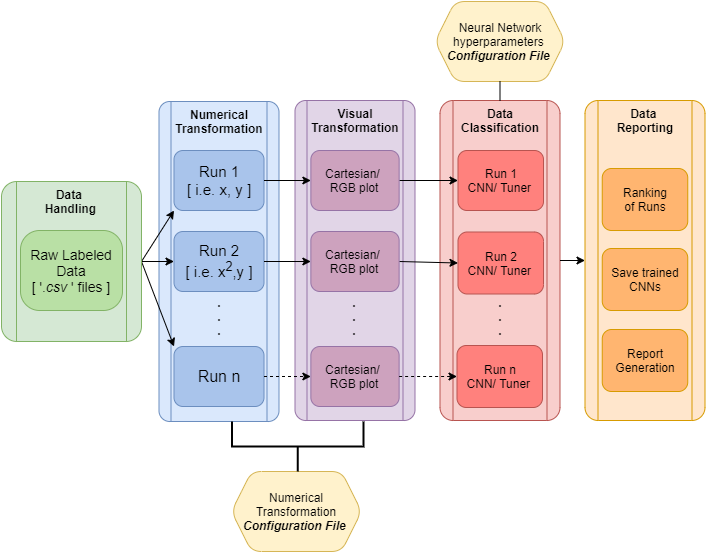
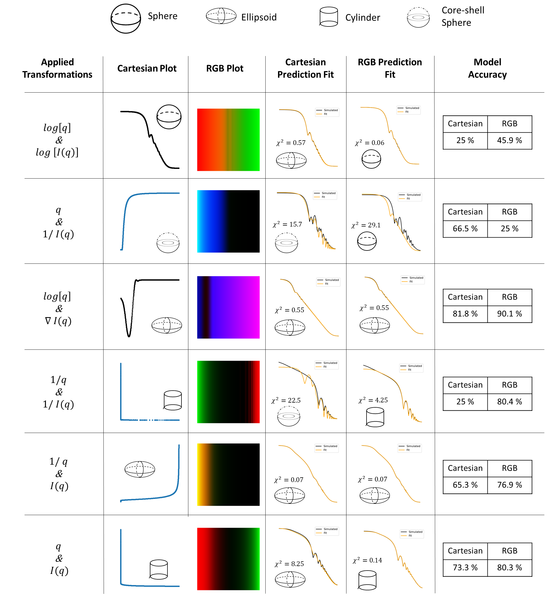

`HARDy` is a python-based package that helps evaluate differences in data through feature engineering coupled with kernel methods. The package provides an extension to machine learning by adding layers of feature transformation and representation. The workflow of the package is as follows:

- _Configuration_: Sets attribute for user-defined transformations, machine learning hyperparameters or hyperparameter space
- _Handling_: Imports pre-labelled data from `.csv` files and loads into the catalogue. Later the data will be split into training and testing sets
- _Arbitrage_: Applies user defined numerical and visual transformations to all the data loaded.
- _Recognition_: Machine Learning module that applies user defined hyperparameter search space for training and evaluation of model
- _Data-Reporting_: Imports result of machine learning models and reports it into dataframes and plots

# Background

High Throughput Experimentation (HTE) and High Throughput Testing (HTT) have exponentially increased the volume of experimental data available to scientists. One of the major bottlenecks in their implementation is the data analysis. The need for autonomous binning and classification has seen an increase in the employment of machine learning approaches in discovery of catalysts, energy materials and process parameters for design of experiment [@williams2019enabling; @becker2019low]. However, these solutions rely on specific sets of hyperparameters for their machine learning models to achieve the desired purpose. Furthermore, numerical data from experimental characterization of materials carries diversity in both features and magnitude. These features are traditionally extracted using deterministic models based on empirical relationships between variables of the process under investigation. As an example, X-ray diffraction (XRD) data is easier to characterize in linear form as compared to small angle X-ray scattering data, which requires transformation of axis to log-log scale.

One of the most widely applied strategy to enhance the performance of machine learning model is Combined Automatic Machine Learning (AutoML) for CASH (Combined Alogrithm Selection and Hyperparameter Optimization) [@hutter2019automated]. However, these packages are only limited to hyper-parameter tuning and data features remain untouched. [To improve the performance of machine learning model] Binning, binarization, normalization, and Box-Cox Transformations are popular feature engineering strategies for simple numerical data like ratings vs. reviews [@zheng2018feature]. Moreover, Deep Feature Synthesis has shown promising results. Here features are generated from relational databases by performing multi-layer mathematical transformation operations [@kanter2015deep]. Another package employs transformation of data in Quantile Sketch Array (QSA) to improve the effectiveness of machine learning model [@nargesian2017learning]. Another aspect often ignored during evaluation of machine learning model is kernel methods based on feature engineering.

`HARDy` presents an infrastructure which aids in the identification of the best combination of numerical and visual transformations to improve data classification through Convolutional Neural Networks (CNN). `HARDy` exploits the difference between human-readable images of experimental data (i.e. Cartesian representation) and computer-readable plots, which maximizes the data density presented to an algorithm and reduce superfluous information. `HARDy` uses configuration files, fed to the open-source package `Keras-tuner`, removing the need for the user to manually generate unique parameters combinations for each neural network model to be investigated.

# Description and Use Case

The python-based package `HARDy` is a modularly structured package which classifies data using 2D convolutional neural networks. A schematic for the package can be found in figure 1.

The package was tested on a set of simulated Small Angle Scattering (SAS) data to be classified into four different particle models: spherical, ellipsoidal, cylindrical and core-shell spherical. A total of ten thousand files were generated for each model. The data was generated using \textit{sasmodels}. The geometrical and physical parameters used to obtain each spectrum were taken from a published work discussing a similar classification task [@ArchibaldRichardK2020Caas]. The name of each SAS model was used as label for the data, allowing for further validation of the test set results. These models were selected as they present similar parameters and data features, which at times make it challenging to distinguish between them.

First, the pre-labelled data was loaded. A subset of the files, three thousand files in total, is identified as the testing set. It is to note that all the ML models initialized in the same code run are validated using the same testing set. A user-provided list of transformations, inputted through a configuration file, is applied to the data. Different trials can be specified, so that multiple sets of transformations can be investigated. Both Cartesian and RGB plots representations were compared. The latter visualization option was obtained by encoding the data into the pixel values of each channel composing a color image, for a total of six-channels available (i.e., 3 RGB channels in horizontal/vertical orthogonal directions). Figure 2 shows an example of numerical and visual transformation applied to a spherical model data.

The data is then fed into a convolutional neural network, whose hyperparameters and structure were defined using another configuration file. Alternatively, it is also possible to train multiple classifiers for a single transformation trial through the use of a tuner, by instead providing a hyperparameter space and a search method. The classification results, as well as the best performing trained model were saved for each transformation run. The package also allows to visually compare, through a parallel coordinates plots (see documentation), the performance of each transformation and, in the case of a tuning session, which hyperparameter combination yielded higher classification accuracy. Figure 3 shows a summary of few runs comparing the two visualization strategies. 

Comprehensive results for all transformations tested are available in the documentation. It can be noticed that data representation using Cartesian coordinate plots yielded a higher number of instances in which the accuracy of the trained machine learning model was ~25\%. This value corresponds to machine learning model's inability to recognize differences in a four-class classification task. On the other hand, the RGB plots show, on average, higher accuracy for the same combinations of numerical transformations. To further validate the results, mathematical fitting was performed on a test set using the SASmodels package. The fitting was based on probabilities determined by the ML model for each label. In scenarios where the output probability was below 70\%, the data was also fitted using the second highest possible SAS model.

The average chi-square parameter of the fitted data was determined to be 7.5. Approximately 11 \% of the data had a probability lower than 70\%. In all cases, if the neural network was not able to correctly label the data with the highest probability label, the second highest probability label was the correct one.

In conclusion, we have demonstrated reliability in the classification task provide by `HARDy`. The code can also be used to guide modeling of data and will help identify the most probable model(s) to use, decreasing significantly the time spent on data analysis. Finally, the minimal user interaction required by the package allows for deployment of the task on a supercomputing cluster system, possibly removing the limitations given by the high computational power required to run these ML algorithms. All configuration files and scripts used to run the example presented in this paper can be found in the package documentation.

# Acknowledgements
This project was supported by: National Science Foundation through NSF-CBET grant no. 1917340, the Data Intensive Research Enabling Clean Technology (DIRECT) National Science Foundation (NSF) National Research Traineeship (DGE-1633216), the State of Washington through the University of Washington (UW) Clean Energy Institute and the UW eScience Institute

# References
